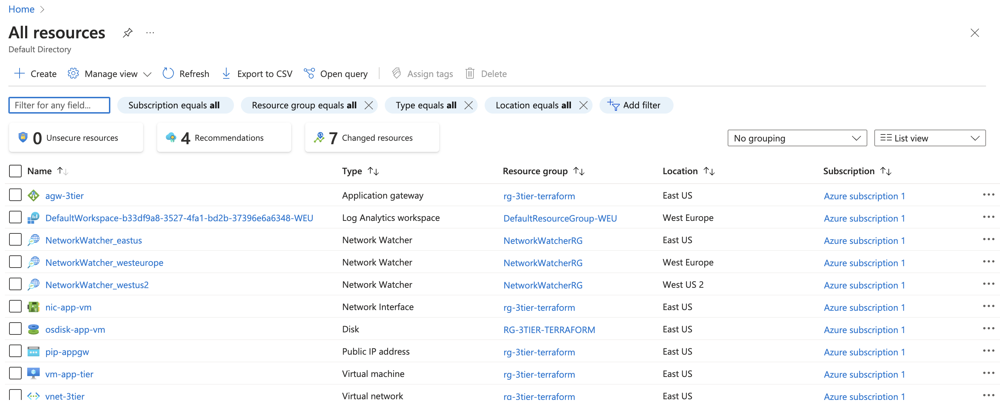
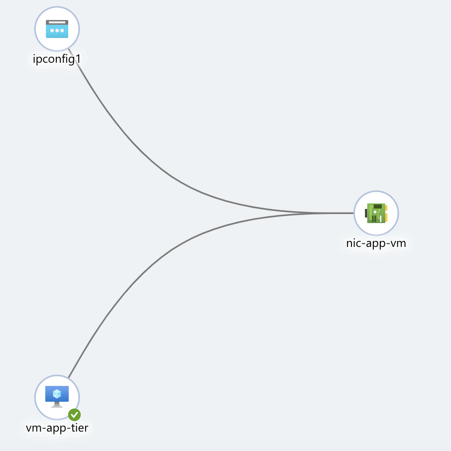
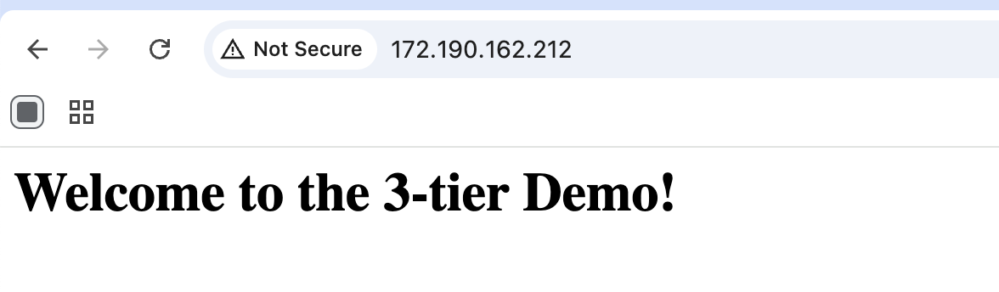

# Terraform Azure Three-Tier Application Gateway Lab

## Project Overview

This project demonstrates how to provision a basic cloud infrastructure on Microsoft Azure using Terraform.

It deploys a simple application architecture where an Azure Application Gateway routes HTTP traffic to a Linux virtual machine running Apache.

---

## Project Purpose

The goal of this lab is to demonstrate Infrastructure as Code (IaC) skills using Terraform, Azure networking, and cloud infrastructure design.

This project reflects practical knowledge of:

- Terraform-based infrastructure provisioning
- Azure Virtual Network and subnet design
- Application Gateway deployment (WAF_v2)
- Public-to-private application traffic flow
- Linux VM deployment
- Web server bootstrapping (Apache)
- Secure GitHub practices for Terraform projects

---

## Project Preview

  

  <em>Overview of all deployed Azure resources</em>

---

## 🏗️ Architecture Overview

The Terraform configuration creates the following resources:

- Resource Group
- Virtual Network
- Application Gateway subnet
- Application subnet
- Public IP address
- Network Interface
- Linux Virtual Machine
- Apache Web Server
- Azure Application Gateway (WAF_v2)

---

## 🔄 Traffic Flow

Internet User
|
v
Public IP
|
v
Application Gateway
|
v
Backend VM (Private Subnet)
|
v
Apache Web Server

---

## Architecture Visualization

### Azure Resources Overview

  

  <em>All deployed Azure components including Application Gateway, VM, and networking</em>

### Virtual Network Design

  

  <em>VNet structure showing subnet separation between Application Gateway and backend VM</em>

### Application Test Result

  

  <em>Successful HTTP response from Apache via Application Gateway</em>

---

## 📂 Repository Structure

├── main.tf
├── variable.tf
├── README.md
└── images/
├── all-resources.png
├── vnet.png
└── welcome.png
